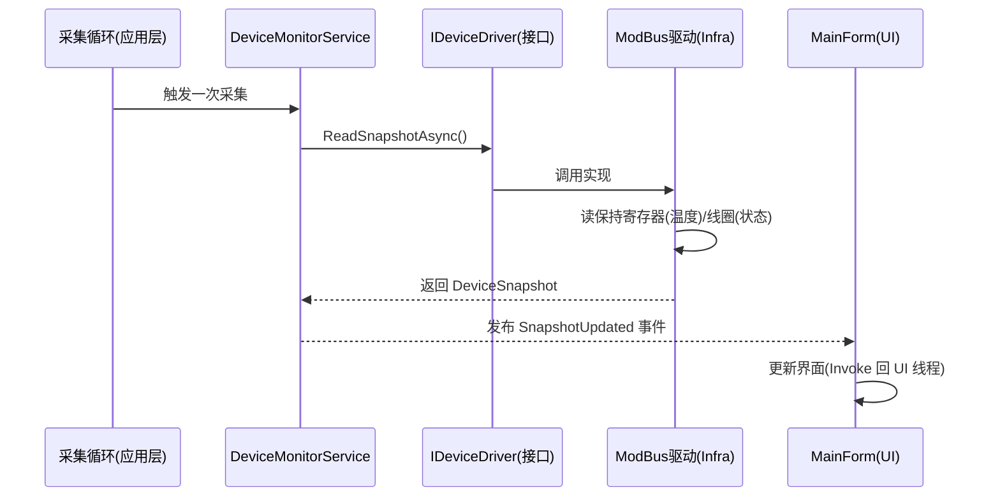
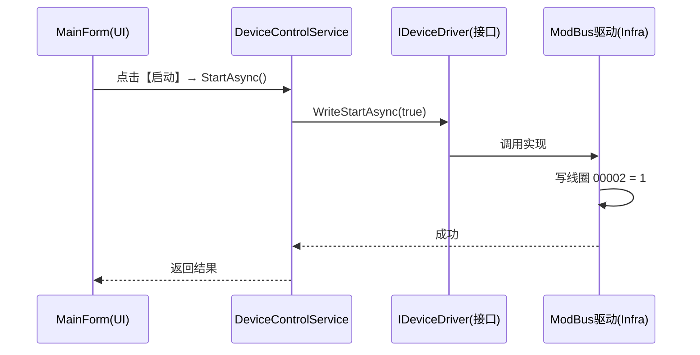

# ModBusStudy 项目架构设计

> 目标：把项目搭建成**多层架构**，与真实企业项目一致。
> 学习架构的核心不是背结构，而是理解"**为什么**要分层、每一层回答什么问题"。

---

## 一、为什么上位机项目要分层？

先看"不分层"会怎样：所有代码都写在 `MainForm.cs` 里——界面代码、业务规则、ModBus 通信混成一团，就会出现：

- 改一个按钮，担心碰坏通信代码；
- 想把"模拟设备"换成"真实 ModBus"，得翻遍整个窗体；
- 业务逻辑没法脱离界面单独测试；
- 多人协作时改同一个文件必然冲突。

分层的本质：**把"界面"、"业务"、"技术细节"这三类性质完全不同的东西分开，各自独立变化、互不影响。**

这个思路你在 ASP.NET 里早就见过：

| ASP.NET 项目 | 职责 |
| ---- | ---- |
| Controllers / Pages | 接收请求、返回结果（入口 / 界面） |
| Application / Services | 用例编排（先校验、再调仓库） |
| Domain | 核心业务规则 |
| Infrastructure | EF Core、第三方 API、日志 |

上位机项目是同一套思路，只是"界面"从 Web 页面变成了 WinForms 窗体，"基础设施"从数据库变成了 ModBus 通信。

---

## 二、整体架构

本项目采用**洋葱架构（Onion Architecture）的简化版**，共四层：

```mermaid
flowchart TB
    subgraph L1[表现层 ModBusStudy.App — WinForms 窗体]
        MainForm
        Controls
    end
    subgraph L2[应用层 ModBusStudy.Application — 用例编排]
        DeviceMonitorService
        DeviceControlService
        AlarmService
    end
    subgraph L3[领域层 ModBusStudy.Domain — 核心契约与模型]
        IDeviceDriver
        IAlarmStore
        DeviceSnapshot
    end
    subgraph L4[基础设施层 ModBusStudy.Infrastructure — 技术细节]
        SimulatedDeviceDriver
        ModBusTcpDeviceDriver
        Logger / Config / AlarmStore
    end
    L1 --> L2
    L2 --> L3
    L4 --> L3
```

**依赖规则（最重要的一条）：**

1. **上层依赖下层**：表现层 → 应用层 → 领域层；基础设施层 → 领域层。
2. **方向永远朝内**：外层可以依赖内层，内层**绝不**知道外层的存在。
3. **领域层最干净**：不引用任何项目、任何第三方包，只有业务契约和模型。
4. **边界用接口**：跨层的数据通道都定义成接口（如 `IDeviceDriver`），实现放在基础设施层，随时可替换。

> 一句话记忆：**内层定"规矩"（接口 / 模型），外层干"活"（实现 / 界面）。**

---

## 三、四层职责详解（结合本项目）

### 3.1 领域层 Domain —— 定规矩

**是什么**：业务世界的"概念"和"契约"，与技术（ModBus、串口、界面）无关。

**包含什么**：

| 文件 | 说明 |
| ---- | ---- |
| `DeviceSnapshot` | 一次采集到的设备状态快照（当前温度、目标温度、加热状态、时间戳） |
| `DeviceState` | 设备状态枚举（运行中 / 已停止） |
| `IDeviceDriver` | 设备驱动接口：`ReadSnapshotAsync` / `WriteStartAsync` / `WriteTargetTemperatureAsync` |
| `IAlarmStore` | 报警存储接口：`AddAsync` / `QueryAsync` |

**为什么接口定义在这里**：接口是"业务契约"——"上位机要能读设备、写设备、存报警"。至于用什么技术实现（模拟类、NModbus、数据库），领域层不关心。这就叫**依赖倒置**：实现反过来依赖接口。

### 3.2 应用层 Application —— 编排功能

**是什么**：把领域层的"零件"组装成用户需要的"功能"，不含技术细节。

**包含什么**：

| 文件 | 说明 |
| ---- | ---- |
| `DeviceMonitorService` | 采集编排：定时调 `IDeviceDriver.ReadSnapshotAsync` → 发布"有新数据"事件 |
| `DeviceControlService` | 控制编排：启动 / 停止 / 设目标温度 → 调 `IDeviceDriver.Write...` |
| `AlarmService` | 报警编排：检查快照是否触发规则 → 写入 `IAlarmStore` → 发布报警事件 |

**为什么需要这一层**：如果让 UI 直接调 `IDeviceDriver`、自己算报警，界面又会变臃肿。应用层把"读数据 → 算报警 → 通知界面"这条链路统一管起来，UI 只订阅结果。

### 3.3 基础设施层 Infrastructure —— 干活的

**是什么**：所有"和外部世界打交道"的技术细节。

**包含什么**：

| 文件 | 说明 |
| ---- | ---- |
| `SimulatedDeviceDriver` | 模拟驱动（实现 `IDeviceDriver`）——内部模拟温控箱的升温 / 降温逻辑 |
| `ModBusTcpDeviceDriver` | 真实通信驱动（实现 `IDeviceDriver`）——用 NModbus 读 / 写寄存器 |
| `ModBusServerSimulator` | （阶段 6）扮演"下位机"的 ModBus TCP 服务器 |
| `NLogLogger` | 日志实现 |
| `AppConfig` | 读 `appsettings.json` 的配置实现 |
| `AlarmFileStore` | 报警记录存储实现（如存 JSON 文件） |

**为什么放这里**：通信、日志、配置、存储都是"可替换的细节"——今天用模拟，明天用 ModBus，后天日志换 Serilog，都只动这一层。

### 3.4 表现层 App —— 给用户看

**是什么**：WinForms 窗体（用户看到的界面）+ 组合根（装配 DI）。

**包含什么**：

| 文件 | 说明 |
| ---- | ---- |
| `MainForm` | 主窗体：订阅应用层事件显示数据；把按钮点击转发给 `DeviceControlService` |
| `Program.cs` | **组合根**：在这里把各层"粘"起来（注册依赖注入） |

**为什么 UI 只做两件事**：显示（订阅事件）+ 转发（调用应用层）。UI 不 new ModBus、不算报警——这样以后界面换掉（比如改 WPF），业务代码一行都不用动。

---

## 四、解决方案与项目结构

```
ModBusStudy.sln
├── src/                                # 源码目录
│   ├── ModBusStudy.Domain/             # 领域层（类库，零依赖）
│   ├── ModBusStudy.Application/        # 应用层（类库，引用 Domain）
│   ├── ModBusStudy.Infrastructure/     # 基础设施层（类库，引用 Domain）
│   └── ModBusStudy.App/                # 表现层（WinForms，引用 Application + Infrastructure）
├── tests/
│   └── ModBusStudy.Tests/              # 单元测试（xUnit，引用 Domain + Application）
├── docs/
│   ├── 代码风格.md
│   ├── 架构设计.md
│   └── 学习路线.md
└── ModBusStudy.sln
```

**项目引用关系：**

| 项目 | 引用哪些项目 | 主要第三方包 |
| ---- | ---- | ---- |
| ModBusStudy.Domain | （无） | （无，保持最干净） |
| ModBusStudy.Application | Domain | （无） |
| ModBusStudy.Infrastructure | Domain | NModbus、Microsoft.Extensions.Logging |
| ModBusStudy.App | Application、Infrastructure | Microsoft.Extensions.DependencyInjection、Hosting |
| ModBusStudy.Tests | Domain、Application | xUnit |

> 为什么 App 要引用 Infrastructure？因为 `Program.cs`（组合根）需要 new 出 `SimulatedDeviceDriver` / `ModBusTcpDeviceDriver` 注册进容器。**只有组合根碰 Infrastructure 的实现，窗体代码不碰。**

---

## 五、两条核心数据流

### 5.1 上行：显示温度（读）



### 5.2 下行：点【启动】（写）



> 两条链路共同点：**UI 永远只跟"应用层的服务"打交道，应用层只跟"接口"打交道，具体技术细节藏在基础设施层。** 这就是上层每次改动都不波及他层的原因。

---

## 六、关键设计决策（为什么这么设计）

1. **为什么用依赖注入（DI）容器？**
   - 你在 ASP.NET 里天天用 `builder.Services.AddScoped<>()`。WinForms 里完全一样：`Program.cs` 里建 `ServiceCollection`，注册驱动、服务、窗体，然后 `BuildServiceProvider()` 解析出 `MainForm` 启动。
   - 好处：换驱动只改一行注册代码；窗体构造函数通过参数拿到服务（构造函数注入），不用自己 new。

2. **为什么用 `IDeviceDriver` 接口而不是直接 new NModbus？**
   - 接口 = "设备长什么样"的契约；实现 = "具体怎么通信"。这样"模拟设备"和"真实 ModBus"可以并存、一键切换，还能给应用层写单元测试（注入一个假的驱动即可）。

3. **为什么 UI 不引用 Domain / Infrastructure 的实现？**
   - 界面只关心"有什么数据、能做什么操作"，不关心"数据从哪来、怎么来的"。依赖越少，换界面越容易。

4. **为什么用事件 / 回调通知界面，而不是界面自己轮询？**
   - 数据生产者（应用层）主动"喊一声"，界面被动"接一下"，比界面自己盯着问更解耦、更省资源。

---

## 七、与学习路线的关系（每阶段写进哪一层）

| 学习路线阶段 | 写进哪一层 | 主要内容 |
| ---- | ---- | ---- |
| 阶段 1 静态界面 | 表现层 App | `MainForm` 布局 |
| 阶段 2 模拟设备 | 领域层 + 基础设施层 | `IDeviceDriver` 接口 + `SimulatedDeviceDriver`（内含模拟温控逻辑，即原计划里的 `TemperatureDevice`） |
| 阶段 3 数据流 | 应用层 + 表现层 | `DeviceMonitorService`、`DeviceControlService`、采集循环 |
| 阶段 4 实时曲线 | 表现层 + 应用层 | Chart 控件、快照数据缓存 |
| 阶段 5 报警 | 应用层 + 基础设施层 | `AlarmService`、`IAlarmStore` 实现 |
| 阶段 6 真实 ModBus | 基础设施层 | `ModBusTcpDeviceDriver`、`ModBusServerSimulator` |
| 阶段 7 工程化 | 全局 | 分层落地、日志、发布、单元测试 |

> 也就是说：**架构从一开始就立好骨架，学习时把每一块代码写进它该在的层里**，而不是最后才重构。

---

## 八、常见误区

1. **误区：分层 = 建几个文件夹。** 企业项目是**多个独立项目（csproj）**，靠项目引用和接口约束依赖方向。
2. **误区：领域层引用第三方库。** 领域层必须零依赖，否则"规则"就和技术绑死了。
3. **误区：所有层互相引用。** 依赖方向永远朝内：UI → 应用 → 领域，基础设施 → 领域。
4. **误区：UI 里 new 设备驱动。** UI 只该通过应用层拿数据，驱动由组合根注册进 DI。
5. **误区：接口和实现放同一层。** 接口放领域层（业务契约），实现放基础设施层（技术细节）。

---

## 九、组合根示意（Program.cs）

```csharp
// ModBusStudy.App/Program.cs —— 组合根（示意）
using Microsoft.Extensions.DependencyInjection;

var services = new ServiceCollection();

// 注册驱动：只改这一行，就能在"模拟设备"和"真实ModBus"之间切换
services.AddSingleton<IDeviceDriver, SimulatedDeviceDriver>();

// 注册应用层服务
services.AddSingleton<DeviceMonitorService>();
services.AddSingleton<DeviceControlService>();
services.AddSingleton<AlarmService>();

// 注册主窗体（构造函数注入各服务）
services.AddSingleton<MainForm>();

using var provider = services.BuildServiceProvider();
ApplicationConfiguration.Initialize();
Application.Run(provider.GetRequiredService<MainForm>());
```

---

> 下一步：确认后即可按此架构把解决方案改造成多项目骨架（创建 5 个项目 + 引用关系 + DI 装配），然后按学习路线逐层填充代码。
